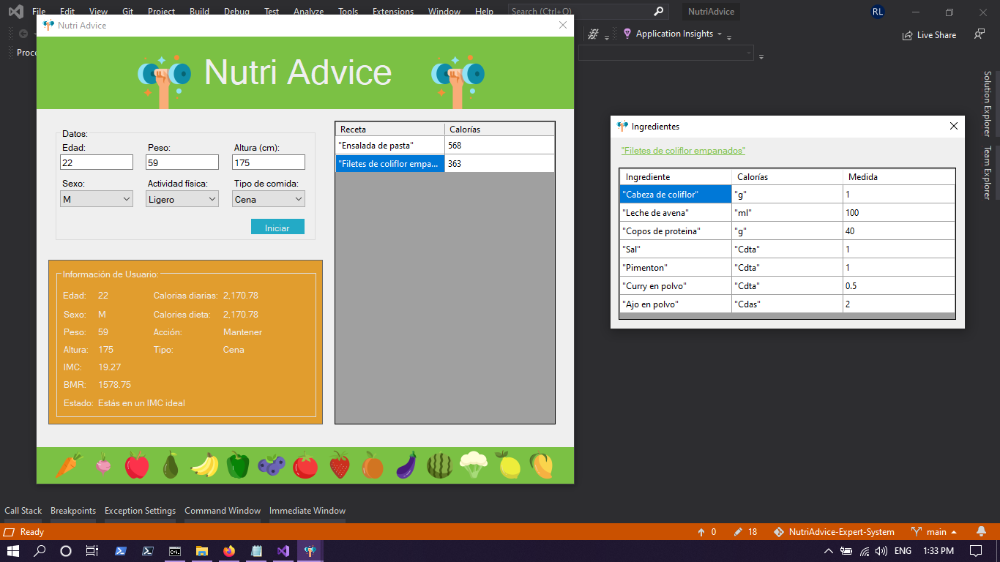

# Sistema Experto - NutriAdvice

Este programa permite generar una serie de recetas que pueden ayudarte a mejorar tu peso en base al `Índice de Masa Corporal`.

## ¿Cómo funciona?

En términos sencillos, te pide una serie de datos que usamos para calcular tu `IMC`, tu `BMR (cantidad de energía necesaria en reposo)` y podemos de esta forma usar condicionales que determinan si deberías bajar, subir o mantenerte en forma. En base a tu nivel de actividad física, podemos también determinar cuántas calorías deberías consumir para logar esto.

Puedes descargar el archivo comprimido con ejecutable y todo funcional, [aquí](https://drive.google.com/file/d/10Ft9DJd0Iqr6tDRIeAI2fAMdykwJd_QQ/view?usp=sharing)

  

